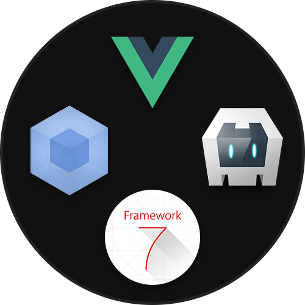

<!--
#
# Licensed to the Apache Software Foundation (ASF) under one
# or more contributor license agreements.  See the NOTICE file
# distributed with this work for additional information
# regarding copyright ownership.  The ASF licenses this file
# to you under the Apache License, Version 2.0 (the
# "License"); you may not use this file except in compliance
# with the License.  You may obtain a copy of the License at
#
# http://www.apache.org/licenses/LICENSE-2.0
#
# Unless required by applicable law or agreed to in writing,
# software distributed under the License is distributed on an
# "AS IS" BASIS, WITHOUT WARRANTIES OR CONDITIONS OF ANY
#  KIND, either express or implied.  See the License for the
# specific language governing permissions and limitations
# under the License.
#
-->



# Framework7 - Vue - Webpack Cordova Template
You can start your new cordova project perfectly with this template.

This template uses:
* [Framework7](https://framework7.io)
* [Vue Js 2](https://vuejs.org/)
* [Webpack 2](https://webpack.github.io/)


## Minimum Requirements
* **Cordova:** _6.0.0_
* **Node.js:** _6.5.0_ (Supports ES6)

## Installation
This template needs cordova. You can install cordova with:
``` bash
npm i cordova -g
```

For more info about cordova installation, please [check this page](https://cordova.apache.org/docs/en/latest/guide/cli/).

---

Okay, you have cordova. Let's do a magic:

``` bash
cordova create <project_create_dir> com.example.projectname "Project Name" --template cordova-template-framework7-vue-webpack
```

boom! :boom: you have your brand new cordova project with framework7 - vue and webpack 2!


---

You don't need to use `npm install` for install node.js dependencies.
As well as you don't need to install `cordova-plugin-browsersync` too.

When you use one of `cordova (run|emulate|build|prepare)` commands, hookers.js will install automagically these things, before run your cordova command.

**Note! Important Cordova Plugin:** This template needs [cordova-plugin-browsersync](https://github.com/nparashuram/cordova-plugin-browsersync). It installs automagically when you use one of `cordova (run|emulate|build|prepare)` commands.

---

Now you need to add platform you want. You can add platform with this command:

```
cordova platform add (browser|android|ios|etc...)
```

And :tada:, all set!

## Usage
You can run all cordova commands.
We have some cool hooks for faster development. If you don't know what is cordova hooks please check [this page](https://cordova.apache.org/docs/en/latest/guide/appdev/hooks/).

---

You don't need to add `<script src="cordova.js"></script>` to your `index.html`. It will be added automagically...

_(Note: If you want to add cordova.js to the page, you can add too.)_

---

```bash
  cordova (emulate|run|build) (android|ios|browser|etc...) [...args] [--live-reload]
```

#### args:
* **--live-reload:**
	* webpack starts to watch `src` folder.
	* when you change any file in `src` folder, webpack will `recompile` files and `refreshes target` automagically!
	
* **--nobuild**
	* webpack will not run.

You can check [hookers.js](hooks/hookers.js) for more information.